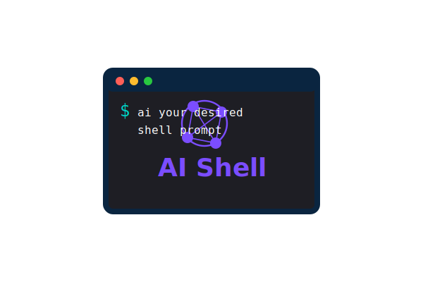

# AI Shell

An AI-powered command line assistant that generates and executes bash commands from natural language prompts.



*AI Shell transforms natural language into powerful bash commands, making the terminal accessible to everyone.*

## Overview

AI Shell is a CLI tool that leverages Anthropic's Claude AI to translate natural language descriptions into executable bash commands. Simply describe what you want to do in plain English, and AI Shell will suggest the appropriate command.

## Features

- 🧠 **AI-powered command generation** - Convert natural language to bash commands
- 🖥️ **Interactive mode** with command history and session management
- 🔄 **ZSH integration** for seamless command insertion (Alt+i shortcut)
- ✏️ **Command editing** with full-featured line editing
- 💾 **Session management** - save and load command sessions
- 📋 **Clipboard integration** for easy command sharing

## Basic Demo


## Installation

### Prerequisites

- Python 3.8 or higher
- [uv](https://github.com/astral-sh/uv) - A faster Python package installer and resolver
- An Anthropic API key ([get one here](https://console.anthropic.com/settings/keys))

### Setup

1. Clone the repository:
   ```bash
   git clone https://github.com/yourusername/ai-shell.git
   cd ai-shell
   ```

2. Install dependencies using uv (recommended):
   ```bash
   # Install uv if you don't have it yet
   pip install uv
   
   # Install dependencies with uv
   uv pip install click pyperclip anthropic prompt_toolkit pyyaml rich
   ```
   
   Alternatively, you can use pip (may be slower):
   ```bash
   pip install click pyperclip anthropic prompt_toolkit pyyaml rich
   ```

3. Set your Anthropic API key (required):
   
   Get your API key from the [Anthropic Console](https://console.anthropic.com/settings/keys) if you don't have one already.
   
   Add it to your environment:
   ```bash
   export ANTHROPIC_API_KEY='your_api_key_here'
   ```
   
   For persistent access, add it to your shell profile:
   ```bash
   echo 'export ANTHROPIC_API_KEY="your_api_key_here"' >> ~/.zshrc
   source ~/.zshrc
   ```

4. Make the script executable:
   ```bash
   chmod +x ai.py
   ```

5. For convenience, set up access to the script using one of these methods:

   a) Create a symlink:
   ```bash
   sudo ln -s $(pwd)/ai.py /usr/local/bin/ai
   ```
   
   b) Or add an alias to your .zshrc (recommended):
   ```bash
   echo 'alias ai="'$(pwd)'/ai.py"' >> ~/.zshrc
   source ~/.zshrc
   ```
   
   Example of what this adds to your .zshrc:
   ```bash
   alias ai="/Users/username/dev/ai-shell/ai.py"
   ```

6. (Optional) Set up ZSH integration for Alt+i command insertion:
   ```bash
   ai --setup-zsh
   ```

## Usage

### Basic Usage

```bash
ai [your prompt here]
```

Examples:
```bash
ai list all files by size
ai find all python files changed in the last week
ai create a tarball of this directory excluding node_modules
```

### Interactive Mode

```bash
ai --interactive
```

This launches an interactive session where you can:
- Generate multiple commands in sequence
- Access command history
- Save and load sessions
- Edit and execute commands directly

### Command Line Options

```
Options:
  --interactive, -i      Run in interactive mode with session management
  --execute, -x          Automatically execute the command
  --no-execute, -n       Don't execute, just show the command
  --setup-zsh            Set up ZSH integration
  --show-zsh-code        Show ZSH integration code
  --debug                Enable debug logging
  --help                 Show help message
```

## Configuration

AI Shell stores configuration and history in the following locations:

- Command buffer: `~/.ai_shell_buffer`
- Command history: `~/.ai_shell_command_history`
- Session history: `~/.ai_shell_history/`

## Troubleshooting

### API Key Issues

If you encounter an error like:

```
Could not resolve authentication method. Expected either api_key or auth_token to be set.
```

This means your ANTHROPIC_API_KEY environment variable is not being recognized. Try:

1. Verify your key exists in the environment:
   ```bash
   echo $ANTHROPIC_API_KEY
   ```

2. Make sure the key is valid and properly formatted (should start with `sk-ant-api...`)

3. Try explicitly exporting it right before running the command:
   ```bash
   export ANTHROPIC_API_KEY="your_api_key"
   ./ai.py your command
   ```

4. If using the script in a different terminal session, make sure your API key is defined in your shell profile.

## ZSH Integration

After setting up ZSH integration with `ai --setup-zsh`, you can press `Alt+i` in your terminal to insert the most recently generated AI command directly into your command line.

## License

[MIT License](LICENSE)

## Author

Ashley Rodan 
github: @ashrodan

## Contributing

Contributions are welcome! Please feel free to submit a Pull Request.
